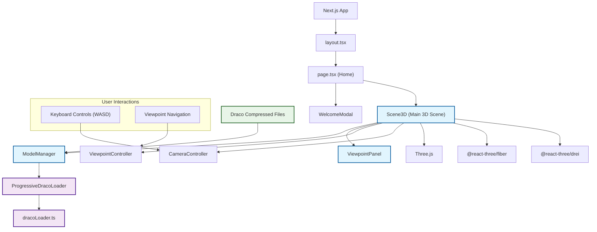

# 3D Web Project Architecture Diagram

## Project Overview (Production Architecture)

This is a **3D Web Application** built with **Next.js** and **Three.js** that provides an interactive 3D environment for visualizing point cloud models. This diagram shows the **production-ready components** only.

### Core Production Features
- **3D Point Cloud Visualization**: Uses Draco compressed geometry format
- **Progressive Loading**: Loads models in multiple quality levels (ultra_low → low → medium → high)
- **Interactive Navigation**: WASD keyboard controls with boundary constraints
- **Viewpoint System**: Predefined camera positions with smooth transitions

### Production Architecture Highlights

1. **Component Hierarchy**: Scene3D acts as the main orchestrator, managing all 3D components and user interactions

2. **Progressive Loading System**: ModelManager coordinates multiple loaders to provide smooth user experience with quality progression

3. **Modular Design**: Each major feature (viewpoints, paths, models) is encapsulated in separate components

4. **Clean Production Build**: Development tools (DevelopmentPanel, ModelControlPanel, Stats) are excluded from production

5. **Configuration-Driven**: Uses JSON files to define models, viewpoints, and paths for easy content management

### Technology Stack
- **Frontend**: Next.js 15, React 19, TypeScript
- **3D Graphics**: Three.js, @react-three/fiber, @react-three/drei
- **Styling**: Tailwind CSS
- **Compression**: Draco geometry compression
- **File Formats**: Draco compressed geometry (.drc)

### Data Flow
1. ModelManager handles progressive loading of 3D assets
2. Scene3D coordinates camera controls, user interactions, and rendering